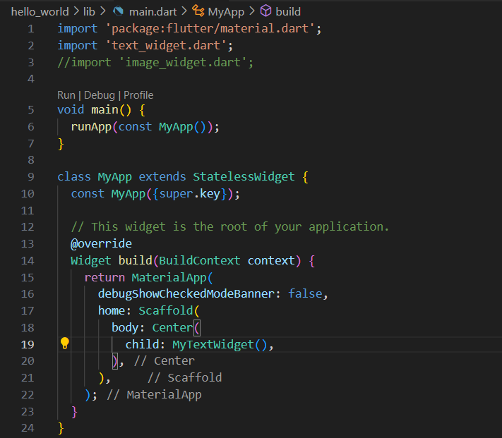

### NAMA  : DANISH NAISYILA AZKA
### NIM   : 362458302098
### KELAS : TRPL-2D

## <h1 align="center">LAPORAN PRAKTIKUM FLUTTER FUNDAMENTAL 1</h1>

 Dalam praktikum Pemrograman Perangkat Bergerak ini, dilakukan pembuatan tampilan aplikasi sederhana menggunakan Flutter dengan menampilkan tulisan Hello World serta menambahkan gambar pada layar. Tujuan dari ini adalah untuk memahami langkah-langkah dasar dalam membuat project Flutter, memodifikasi file utama main.dart, membuat widget baru pada file terpisah, serta memanggil aset gambar melalui pubspec.yaml. 

 Untuk membuat tulisan Hello World dan menampilkan gambar pada Flutter dilakukan melalui beberapa tahapan. Pertama, buat project Flutter baru dengan menulis "Flutter: New Project".
 

 Pada tahap ini kita memilih folder tujuan dan memberi nama project, dengan nama hello_world, agar file dan struktur project tersimpan dengan rapi di dalam folder yang sudah ditentutkan.
 

 Kemudian masukkan nama new project dengan nama yang disuruh yaitu hello_world.
 

 Setelah project berhasil dibuat, didalam folder lib menampilkan isi file main.dart yang secara otomatis dibuat oleh Flutter. Di dalamnya terdapat fungsi main dan class MyApp yang menjadi titik awal aplikasi. 
 

 Lalu kita membuat file baru yaitu text_widget.dart, kita membuat widget sederhana untuk menampilkan tulisan Hello World. Di dalamnya ada class MyTextWidget yang dibuat dengan StatelessWidget. Class ini punya method build() yang akan mengembalikan widget Center sebagai wadah utama, dan di dalamnya ada widget text yang menampilkan tulisan Hello World. Tulisan ini juga bisa kita atur tampilannya, misalnya ukuran huruf, warna, atau ketebalannya, dengan menggunakan properti style.
 

 Untuk main.dart dengan MyTextWidget, pertama kita mengimpor text_widget.dart, lalu pada bagian build() dibuat struktur aplikasi menggunakan MaterialApp dan Scaffold. Di dalam Scaffold, tredapat center yang berfungsi untuk meletakkan widget di tengah layar. Di dalam center dipanggil MyTextWidget(), yaitu widget yang isinya menampilkan text hello world. Jadi, ketika aplikasi dijalankan, yang muncul adalah tulisan di tengah layar.
 

 Jika ingin melihat tampilannya kita pergi ke terminal dengan munulis "flutter run", lalu nantinya kita akan diberikan pilihan seperti gambar dibawah ini, pilih browser yang sering kita pakai.
 

 Maka tampilannya akan seperti ini...
 

 Untuk menampilkan gambar, kita membuat file baru terlebih dahulu dengan nama image_widget.dart. Di dalamnya ada class MyImageWidget yang juga menggunakan StatelessWidget, Class ini punya method build() yang akan mengembalikan widget center sebagai wadah utama, lalu di dalamnya ada widget image. 
 

 Supaya gambar bisa muncul, file gambarnya harus sudah disimpan di folder assets dan memasukkan file gambar di pubspec.yaml. 
 

 Untuk main.dart dengan MyImageWidget, strukturnya hampir sama. Bedanya, yang dipanggil di dalam center adalah MyImageWidget. Widget ini isinya menampilkan gambar dari folder assets menggunakan image.assets. 
 

 Lalu ke terminal lagi untuk menjalankannya, seperti gambar di bawah ini.
 

 Maka tampilannya akan seperti ini...
 

